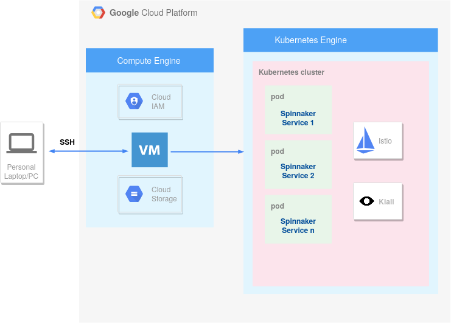

## Tools, scripts, and data generated in the SYMBIOTE method evaluation.
The SYMBIOTE method was developed in the master's project, whose dissertation was defended in Nov / 2020 at the Unicamp Institute of Computing. The dissertation is available at http://repositorio.unicamp.br/bitstream/REPOSIP/353355/1/Apolinario_DanielRodrigoDeFreitas_M.pdf.

Below is a brief summary of the contents of the repository folders:

* *R*: R script to analyze the collected coupling metrics of Spinnaker tool.
* *backup-config*: Backup of the deployment settings of the Spinnaker releases used.
* *main-artifact-results*: Dependency graphs images that represent the dependencies between services.
* *releases*: All artifacts produced for deploying, testing and extracting the metrics for each release of Spinnaker used in this evaluation of SYMBIOTE.
* *tool-results*: Output from the tool that calculates the metrics for Spinnaker releases.

## Environment

Setting up an environment to deploy Spinnaker requires performing a series of tasks. There are different deployment ways and the first step is to understand them all to decide which path to follow. 

Initially, we installed on a local machine (laptop). However, hardware configurations did not meet application requirements properly, causing slowness and temporary errors related to the lack of resources. Therefore, we deployed it on the Google Cloud Platform (GCP), as in Figure [below](#spinnaker-deployment-environment-overview). We installed Spinnaker in its distributed mode, which is the recommended mode for deployments in production. This environment followed the model proposed in the [Spinnaker documentation](https://spinnaker.io/setup/quickstart/halyard-gke/).

##### Spinnaker deployment environment overview

 

Although there are several ways to install Spinnaker, such as using Helm charts, the Spinnaker documentation strongly recommends using the Halyard tool for any type of deployment. Halyard is a command-line tool developed in Java that is responsible for Spinnaker's configuration and deployment activities. Halyard can be installed in a local machine, VM, or in a Docker container. When deploying to apply the SYMBIOTE method, we chose to install Halyard on a VM created on the GCP. 

In addition to the VM in Google Compute Engine (GCE), we are using Google Identity and Access Management (IAM) users, roles and permissions, and Google Compute Storage (GCS) for Spinnaker to create and manage buckets. We also used the Google Kubernetes Engine (GKE) to create the cluster on which we installed Spinnaker, Istio, and Kiali. The VM accesses GKE through the *kubectl* tool.

## Configuration

To configure the basic deployment of a version of Spinnaker, several steps are necessary, the main ones being:
* Choose the deployment version. Halyard shows which versions are available (which are not yet in deprecated mode). The Spinnaker team has maintained the last 4 minor releases.
* Select the cloud providers that will be integrated into the Spinnaker deployment. In this step, we perform the settings that allow Spinnaker to communicate with the available cloud providers, such as GCP, Amazon, Azure, Cloud Foundry, etc. 
* Choose the environment: In this case, the options are: (i) install distributed services to run on Kubernetes; (ii) local installation of Debian packages; (iii) local git installation from GitHub. The first option deploys the microservices separately, indicated for production environments.
* Choose a storage service. Spinnaker offers several storage options such as GCS, Azure Storage, S3, Minio, and others.
* Based on the settings, the Halyard automatically deploys Spinnaker.

To perform the integration tests, it is essential to capture all dependencies at run time, we need additional configurations:
* Authentication and authorization: Spinnaker allows using authentication methods via OAuth2 and existing authorization providers. We use GitHub for both authentication and authorization.
* Integration with Jenkins: we installed an instance of Jenkins on the Kubernetes cluster at GKE to test the automatic triggering of pipelines in Spinnaker from the results of jobs in Jenkins.
* Enable the Spinnaker Canary Analysis feature. Also, we enable Google Cloud Monitoring and configure Spinnaker to integrate with Google's StackDriver metrics.
* Configure Deck and Gate services for external access to the GCP network. We changed the type of these services to be *LoadBalancer*.
* We installed the [Spin CLI tool](https://spinnaker.io/guides/spin/) to automate the execution of test scenarios. As we deployed several versions, we can optimize the time to run tests using this tool.

## Integration Tests

The integration tests in Spinnaker aims to make the services carry out all possible communications with each other. We have no objective of testing the system's functionalities, but only a minimum set that allows us to generate a complete dependency graph. Through the Slack tool, we consulted the Spinnaker community to find out if they already had some kind of automated integration test. We were informed that there is some test of this type, however, the configuration from scratch would take too long and that they could not support us.

Therefore, we have defined and implemented some test scenarios that cover:
* Execution of the authorization mechanism via GitHub. To make it easier, we have not created any role/permission, which by default means full permission.
* Creation of applications within Spinnaker, which represent services.
* Creation of deployment pipelines, which represent a sequence of actions (called stages).
* Creation of configuration for canary releases.
* Pipeline execution that is triggered by a Jenkins job.
* Pipeline execution whose stages aim to create a VM and then deploy it.
* Execution of pipeline whose stages aim at the deploy of an application in the Kubernetes cluster via manifest file (YAML format).
* Execution of pipeline whose stages aim to run an automatic analysis of canary releases for deployment in production.
